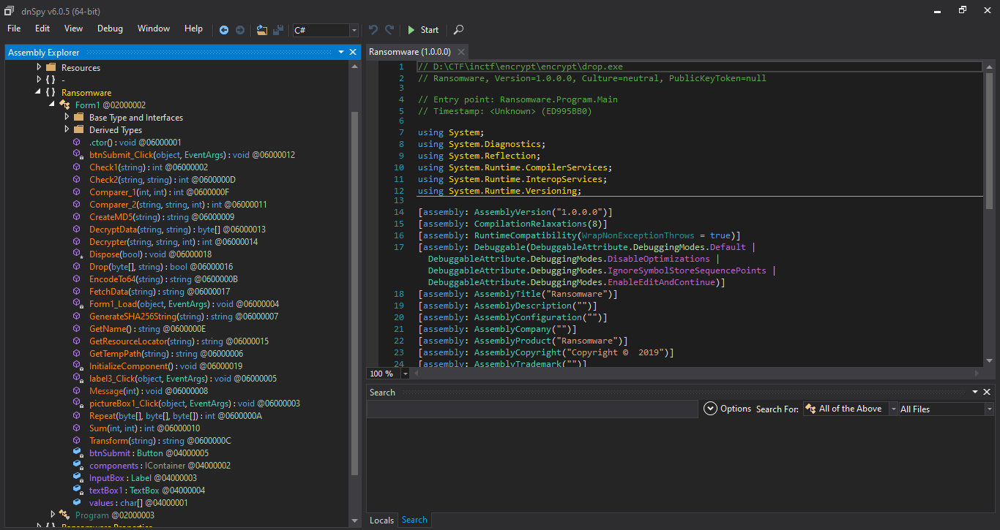
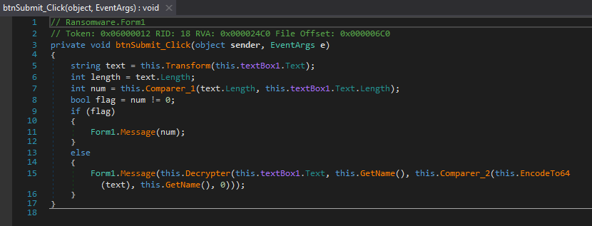
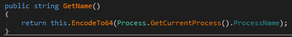
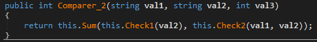
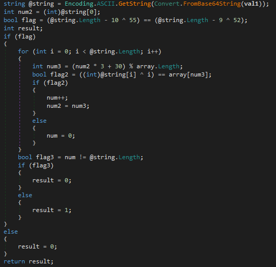
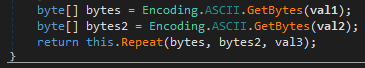
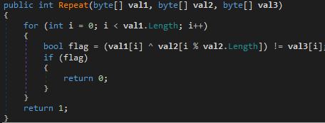
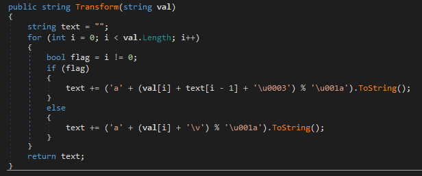

# InCTF 2019 Writeup

**Reverse Engineering: Encrypt**

When running drop.exe, I saw a form with an input.

This is a challenge written in C#. Let's decompile it with dnSpy =))))



Well, a bunch of functions. I will start from the **btnSubmit_Click**. 



This function takes the input as **this.textBox1.Text**, then a string called **text** is generated from input by **Transform** function. Then lengths of 2 strings are checked in **Comparer_1** function and the return value should be 0. We also need the **Decrypter**, **GetName** and **Comparer_2**.

In this challenge, I will find out the input by checking **GetName** and **Comparer_2** first.



This function get the **process name** and convert it by base64



This function returns sum of 2 check, the **Sum** function simply returns sum of 2 integers. Now we look back the **Comparer_2**, the first argument is the **text** converted to base64, and the second one is the **process name**. Therefore, **Check1** checks the **process name**, and **Check2** checks **text** and **process name** respectively. 

Let's have a look at **Check1**



An array called **array** is used to check our input (**val1**). **num2** gets the ascii number of first character of the input (after being converted to normal characters), and the first step in the loop checks if @string[0] ^ 0 == array[num3]. So I write a little python code to check posible first character.

```python
for first in range(32, 128):
	num2 = first
	num3 = (num2 * 3 + 30) % len(array)
	if first ^ 0 == array[num3]:
		print(chr(first))
```

The result is only **t**. Great! I only need to undo the code.

```python
num2 = ord('t')
process = ""
for i in range(100):
	num3 = (num2 * 3 + 30) % len(array)
	process += chr(array[num3] ^ i)
	num2 = num3
print(process)
```

However, only 15 first characters are printable. But 15 is satisfied the condition of length of input. So our process name is **tHinK_M4lici0us**. Now we look at **Check2** and **Repeat**.





Hmm, remember that we have to convert **process name** to base64 first. And look at **Repeat**, I also undo this code.

```python
from base64 import b64encode, b64decode
val2 = b64encode(b"tHinK_M4lici0us")
val1 = ""
for i in range(len(val3)):
	val1 += chr(val2[i % len(val2)] ^ val3[i])
print(b64decode(val1))
```

And the **text** is **ahxsylrmxgmjlylipckxdiqwrjwwrxbtfliyvvsuh**.

Now we need to recover input from **text**.



I was totally stucked in here, and then I got the hint from author about the character set but I forgot it. This below code is the idea to bruteforce.

```python
text = "ahxsylrmxgmjlylipckxdiqwrjwwrxbtfliyvvsuh"
ans = ['C', 'Y', 'b', '3', 'r', '_', '@', '_', '$', '#', '@', 'r', '3', 'd', '_', 'R']
def keygen(i):
	if i > 40:
		return
	for j in range(32, 128):
		if ord(text[i]) == ord('a') + (j + ord(text[i-1]) + 3) % 26:
			ans.append(chr(j))
			if len(ans) == len(text):
				print(''.join(ans))
			else:
				keygen(i+1)
			ans.pop()
keygen(16)
```

And there we are, input is **CYb3r_$3CuriTy_is_@_$#@r3d_R3$p0^$ibiliTy**. Of course, when you put this to input box, it reponses *Wrong input* =)))) because the **Message** function do it.

Now look at **Decrypter**, it's quite simple. First, it creates a MD5 hash from input + process_name (in base64) ans stores it in **text**. You should try to figure out what next functions do :D . Finally, the **Drop** function creates a file with filename **encrypterXX.exe** in temporary directory of your computer (this path can be gotten from **GetTempPath** function). XX are 2 random characters. That is the encrypting file!!! It's time to find out how the data encrypted and exported to **Image.png**.

When I decompile **encrypterXX.exe**, it encrypts by using Microsoft system. The only thing we need to do is to change this code a little bit, replace **CryptEncrypt** to **CryptDecrypt** =)))) Now is your turn to try to code decrypting file, and the key is **encrypterXX.exe\0**. Decrypt the file 2 times and you will get the flag.

Thanks for reading!