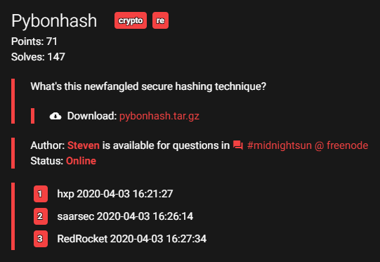
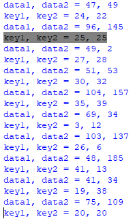

# Midnightsun CTF 2020

Giải này có 4 bài crypto thì mình làm ra 1 bài pyBonHash. Sau đây là writeup của mình.

### pyBonHash



[pybonhash.tar.gz](pybonhash.tar.gz)

Đề cho mình 1 file hash.txt (là ciphertext) và pybonhash.cpython-36.pyc. File pyc là file python đã compile nên mình không thể đọc được. Trên mạng có khá nhiều trang decompiler file pyc, chẳng hạn mình dùng trang [này](https://www.toolnb.com/tools-lang-en/pyc.html). Decompile file pyc của đề mình được file python với nội dung như sau:

```python
# uncompyle6 version 3.5.0
# Python bytecode 3.6 (3379)
# Decompiled from: Python 2.7.5 (default, Aug  7 2019, 00:51:29) 
# [GCC 4.8.5 20150623 (Red Hat 4.8.5-39)]
# Embedded file name: pybonhash.py
# Compiled at: 2020-03-28 21:11:38
# Size of source mod 2**32: 1017 bytes
import string, sys, hashlib, binascii
from Crypto.Cipher import AES
from flag import key
if not len(key) == 42:
    raise AssertionError
data = open(sys.argv[1], 'rb').read()
if not len(data) >= 191:
    raise AssertionError
FIBOFFSET = 4919
MAXFIBSIZE = len(key) + len(data) + FIBOFFSET

def fibseq(n):
    out = [0, 1]
    for i in range(2, n):
        out += [out[(i - 1)] + out[(i - 2)]]

    return out


FIB = fibseq(MAXFIBSIZE)
i = 0
output = ''
while i < len(data):
    data1 = data[(FIB[i] % len(data))]
    key1 = key[((i + FIB[(FIBOFFSET + i)]) % len(key))]
    i += 1
    data2 = data[(FIB[i] % len(data))]
    key2 = key[((i + FIB[(FIBOFFSET + i)]) % len(key))]
    i += 1
    tohash = bytes([data1, data2])
    toencrypt = hashlib.md5(tohash).hexdigest()
    thiskey = bytes([key1, key2]) * 16
    cipher = AES.new(thiskey, AES.MODE_ECB)
    enc = cipher.encrypt(toencrypt)
    output += binascii.hexlify(enc).decode('ascii')

print(output)
```
Độ dài của key là 42, và độ dài data phải lớn hơn hoặc bằng 191. Hàm **fibseq** không khó nhận ra mục đích là tạo dãy số Fibonacci. Các bạn có thể xem ở [đây](https://en.wikipedia.org/wiki/Fibonacci_number).

**FIB** là dãy số Fibonacci tới số hạng thứ MAXFIBSIZE. Giờ tới phần mã hóa. Khởi gán i = 0. Trong mỗi lặp mình có:

- data1: lấy data ở vị trí FIB[i] % len(data)
- key1: lấy key ở vị trí (i + FIB[FIBOFFSET + i]) % len(key)
- Tăng i lên 1
- data2 và key2 tính giống data1 và key1
- Tăng i lên 1
- toencrypt là mã hash md5 của bytes([data1, data2])
- thiskey là key tạo ra từ bytes([key1, key2]) lặp lại 16 lần.
- Sau khi toencrypt được mã hóa bởi AES ở MODE_ECB, dùng khóa là thiskey, ciphertext được lưu vào enc
- output ghép vào sau ciphertext đã được chuyển thành dạng hexa

**Ngừng đọc và suy nghĩ**: khá là lung tung và có vẻ như việc phá AES là bất khả thi!!! Đúng không nhỉ? :))))

len(key) = 42 là cố định, và mình để ý thấy mỗi lần lặp cần 2 vị trí trong data nên mình gán len(data) = 192 luôn.

Đầu tiên, cách lấy index của data1, key1 (data2 và key2 tương tự) làm mình thấy rất "hoang mang", không biết có tính chất gì không nhỉ? Thử code 1 đoạn lấy index xem sao :D

```python
def fibseq(n):
    out = [0, 1]
    for i in range(2, n):
        out += [out[(i - 1)] + out[(i - 2)]]

    return out

FIB = fibseq(4919 + 42 + 192)
i = 0
while i < 192:
	data1 = FIB[i] % 192
	key1 = (i + FIB[4919 + i]) % 42
	i += 1
	data2 = FIB[i] % 192
	key2 = (i + FIB[4919 + i]) % 42
	i += 1
	print("data1, data2 = {0}, {1}".format(data1, data2))
	print("key1, key2 = {0}, {1}".format(key1, key2))
```

Mình để ý thấy 1 số vị trí khá thú vị như dưới đây:



Index của key1 và key2 trùng nhau. Vì vậy, thay vì phải giải mã từ AES rồi crack ngược md5 sao ta không .......... bruteforce nó luôn nhỉ? :D đó chính là ý tưởng của mình. Mình sẽ bắt đầu từ những vị trí mà index của key1 = index key2, mình có index data1 và data2 rồi (code ở trên) thì mình chỉ cần bruteforce xem giá trị ở data1 và data2 là gì, và với key_s nào sẽ cho ra ciphertext khớp với đề cho. Khi tìm được key_s thì mình lưu lại giá trị vào đúng index đó trong key ban đầu.

Tiếp theo, khi mình bắt gặp vị trí mà index key1 khác index key2, nếu mình đã giải ra key1 hoặc key2 thì mình làm động tác bruteforce tương tự cho key còn lại chưa giải ra. Sau đây là hàm bruteforce:

```python
def find_match(ciphertext, knownkey = 65, hasother = 0): 
	# hasother = 0 when it doens't have other
	# hasother = 1 when knownkey is behind key
	# hasother = -1 when knowkey is before key
	for data1 in range(128):
		for data2 in range(128):
			tohash = bytes([data1, data2])
			toencrypt = hashlib.md5(tohash).hexdigest().encode()
			for key in range(32, 128):
				if hasother == 1:
					thiskey = bytes([key, knownkey]) * 16
				elif hasother == -1:
					thiskey = bytes([knownkey, key]) * 16
				else:
					thiskey = bytes([key, key]) * 16
				cipher = AES.new(thiskey, AES.MODE_ECB)
				enc = cipher.encrypt(toencrypt)
				# print(binascii.hexlify(enc), text)
				if ciphertext == binascii.hexlify(enc):
					print("\t\tFound data1, data2, key = {0}, {1}, {2}".format(data1, data2, key))
					return (data1, data2, key)
```

**Note**: khi giải mình vét từ 0 tới 256 rất lâu nhưng khi đã giải xong thì mình mới phát hiện key và data đều là ký tự in được nên ở đây mình đưa code chạy "ít trâu bò" hơn.

Hàm này mình nhận tham số là ciphertext (lấy từ file hash.txt), knownkey trong trường hợp có 2 key khác nhau (default là 65) và hasother nếu có 2 key (default = 0 khi 2 key giống nhau). Mình encrypt y như đề bài và so sánh kết quả với ciphertext, nếu đúng thì trả về data1, data2 và key.

Mình cần lưu lại index của data1, data2 và key để lưu kết quả của hàm **find_match** về đúng vị trí của nó. Mình tận dụng hàm mình code ở trước và tạo 1 số mảng để lưu index lẫn kết quả:

```python
plaintext = [-1] * 192
keyfound = [-1] * 42
keyindex = []
dataindex = []

FIB = fibseq(MAXFIBSIZE)
i = 0
while i < 192:
	data1_idx = FIB[i] % 192
	key1_idx = (i + FIB[FIBOFFSET + i]) % 42
	i += 1
	data2_idx = FIB[i] % 192
	key2_idx = (i + FIB[FIBOFFSET + i]) % 42
	i += 1
	keyindex.append((key1_idx, key2_idx))
	dataindex.append((data1_idx, data2_idx))
```

Xử lý nào!

```python
while -1 in keyfound:
	for k in range(len(keyindex)):
		print(keyindex[k])
		if keyindex[k][0] == keyindex[k][1]:
			if keyfound[keyindex[k][0]] != -1: continue
			plaintext[dataindex[k][0]], plaintext[dataindex[k][1]], keyfound[keyindex[k][0]] = find_match(data[k * 64: (k + 1) * 64])
		else:
			if keyfound[keyindex[k][0]] != -1 and keyfound[keyindex[k][1]] == -1:
				plaintext[dataindex[k][0]], plaintext[dataindex[k][1]], keyfound[keyindex[k][1]] = find_match(data[k * 64: (k + 1) * 64], keyfound[keyindex[k][0]], -1)
			elif keyfound[keyindex[k][0]] == -1 and keyfound[keyindex[k][1]] != -1:
				plaintext[dataindex[k][0]], plaintext[dataindex[k][1]], keyfound[keyindex[k][0]] = find_match(data[k * 64: (k + 1) * 64], keyfound[keyindex[k][1]], 1)
			else: continue
		print(plaintext, keyfound, dataindex[k])
```

Việc chạy mất thời gian khá lâu, và flag chính là key =)))) 

**Note**: trong quá trình chạy các bạn sẽ thấy plaintext đôi khi không khớp, ví dụ plaintext[2] sẽ có nhiều giá trị. Đó là do mã hash md5 bị đụng độ thôi, key sẽ không thay đổi.

Key tìm được sẽ là [109, 105, 100, 110, 105, 103, 104, 116, 123, 120, 119, 74, 106, 80, 119, 52, 86, 112, 48, 90, 108, 49, 57, 120, 73, 100, 97, 78, 117, 122, 54, 122, 84, 101, 77, 81, 49, 119, 108, 78, 80, 125]

**Flag**: midnight{xwJjPw4Vp0Zl19xIdaNuz6zTeMQ1wlNP}

