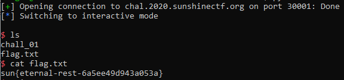
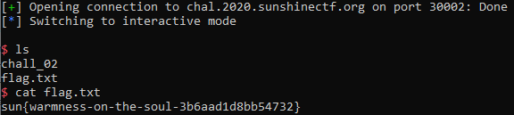

# Sunshine CTF 2020

## 1. Crypto

Giải này chỉ có 1 bài crypto, và đây là writeup của mình:

### Magically Delicious

**Description**

Can you help me decipher this message?

⭐🌈🍀 ⭐🌈🦄 ⭐🦄🌈 ⭐🎈🍀 ⭐🦄🌑 ⭐🌈🦄 ⭐🌑🍀 ⭐🦄🍀 ⭐🎈⭐ 🦄🦄 ⭐🦄🎈 ⭐🌑🍀 ⭐🌈🌑 ⭐🌑⭐ ⭐🦄🌑 🦄🦄 ⭐🌑🦄 ⭐🦄🌈 ⭐🌑🍀 ⭐🦄🎈 ⭐🌑🌑 ⭐🦄⭐ ⭐🦄🌈 ⭐🌑🎈 🦄🦄 ⭐🦄⭐ ⭐🌈🍀 🦄🦄 ⭐🌈🌑 ⭐🦄💜 ⭐🌑🦄 🦄🦄 ⭐🌑🐴 ⭐🌑🦄 ⭐🌈🍀 ⭐🌈🌑 🦄🦄 ⭐🌑🦄 ⭐🦄🌈 ⭐🌑🍀 ⭐🦄🎈 ⭐🌑🌑 ⭐🦄⭐ ⭐🦄🌈 ⭐🌑🎈 🦄🦄 ⭐🦄🦄 ⭐🌑🦄 ⭐🌈🌑 ⭐🦄💜 ⭐🦄🎈 ⭐🌑🌑 ⭐🎈🦄

Note: If you don't see a message above, make sure your browser can render emojis.

**Solution**

Mình thống kê thấy ở đây có 8 loại emojis khác nhau, và được phân bố thành từng cụm 3 (hoặc 2), nên mình nghĩ tới base 8. Mình biểu diễn các ký tự in được (ascii từ 32 tới 127) thì thấy đúng là các cụm 3 (hoặc 2), và các cụm 3 bắt đầu là *1*. Tức là emoji **⭐** là 1. Rồi từ format flag là *sun{....}* thì mình dùng 4 cụm đầu và cụm cuối, suy ra **🍀** là 3, **🎈** là 7, **🌈** là 6, **🦄** là 5. Tiếp tục dò các ký tự tiếp theo dễ đoán rằng là từ *lucky* và mình có thêm **🌑** là 4. Còn 2 emojis tương ứng 0 và 2. Mình thử sai luôn :))) và mình có flag: **sun{lucky-octal-encoding-is-the-best-encoding-method}**

## 2.  Reversing

### Hotel Door Puzzle

**Description**:

I thought I'd come down to Orlando on a vacation. I thought I left work behind me! What's at my hotel door when I show up? A Silly reverse engineering puzzle to get into my hotel room! I thought I was supposed to relax this weekend. Instead of me doing it, I hired you to solve it for me. Let me into my hotel room and you'll get some free internet points!

[hotel_key_puzzle](hotel_key_puzzle)

**Solution**

Sử dụng *Ghidra* mình dễ thấy rằng cần nhập key vào chỗ *local_58*. Và chương trình kiểm tra key bằng hàm **check_flag**. Có rất nhiều điều kiện, và ........  thử thôi. Note lại những vị trí đã kiểm tra rồi để không phải xem lại và mình có flag: **sun{b3llh0p5-runn1n6-qu1ckly}** (mệt thật sự luôn các bạn ạ)

## 3. Speedrun

#### speedrun-00

**Description**:

nc chal.2020.sunshinectf.org 30000

[chall_00](chall_00)

**Solution**

Khi dùng *Ghidra* mình thấy rằng mình sẽ nhập 1 chuỗi vào bằng hàm **gets** và đây là bài buffer overflow cơ bản. Mình cần ghi đè lên biến *local_c* hoặc *local_10* (cái nào gần *local_48* là chuỗi của mình hơn thì ghi đè cho tiện). Bây giờ nhìn vào mã assembly

Từ hàm **gets** dò ngược lên, mình thấy *local_48* (chuỗi mình nhập) ở bị trí [rbp-0x40]. Và nếu bạn click vào chữ *local_c* và nhìn góc dưới phải cửa sổ sẽ thấy lệnh **cmp dword ptr [rbp-0x4], 0xfacade**. Vậy tức là *local_c* nằm ở vị trí [rbp-0x4]. Làm tương tự, mình có *local_10* nằm ở vị trí [rbp-0x8].

Như vậy, stack của mình từ cao xuống thấp sẽ là:

[rbp cũ] - [*local_c* (4 bytes)] - [*local_10* (4 bytes)] - [*local_48* (56 bytes)]

Như vậy, mình cần truyền vào 56 bytes để lấp đầy *local_48*, và 4 bytes cho *local_10* sao cho đúng bằng 0xfacade (theo dạng little endian tức là decafa).

Code exploit ở [chall00.py](chall00.py)

Flag: **sun{burn-it-down-6208bbc96c9ffce4}**

### speedrun-01

**Description**

nc chal.2020.sunshinectf.org 30001

[chall_01](chall_01)

**Solution**

Bài này tương tự bài trước, có thêm 1 biến *local_28* và chỉ được nhập 0x13 bytes. Bug vẫn là ở biến *local_68*

Lần này mình nhập cho *local_28* vài bytes đại thôi vì cuối cùng hàm **fgets** sẽ chỉ lấy tối đa 0x13 byte. Ở biến *local_68*, mình nhập cho đủ 0x60-0x8 (để tới *local_10*), và ghi đè lên *local_10* bằng giá trị decafa.

Code exploit ở [chall01.py](chall01.py)

Flag: **sun{eternal-rest-6a5ee49d943a053a}**

### speedrun-02

**Description**

nc chal.2020.sunshinectf.org 30002

[chall_02](chall_02)

**Solution**:

Ở hàm main ta cần nhập 1 chuỗi nhưng không exploit được, hàm **fgets** an toàn. Mình xem hàm **vuln**. Ở đây mình có thể khai thác hàm **gets**, và việc cần làm là ghi đè return address, nằm trên rbp cũ. Các bạn có thể xem ở quyển *Nghệ thuật tận dụng lỗi phần mềm* để có cơ sở về 32 bit. Bài này cũng là 32 bit :)))

Mình có địa chỉ hàm **win** là 080484d6, và mình cần overflow 0x3a bytes (từ *local_3a* tới ebp), 4 bytes cho ebp cũ, và ghi đè lên return address là little endian của địa chỉ hàm **win**

Code exploit ở [chall02.py](chall02.py)

### speedrun-04

**Description**

nc chal.2020.sunshinectf.org 30004

[chall_04](chall_04)

**Solution**:

Tương tự **speedrun-02**, mình sẽ exploit hàm **vuln**. Ở đây hàm **fgets** lấy 100 byte trong khi *local_48* chỉ có 56 byte. Vậy mình có thể ghi đè *local_10*. Mình thấy ở mã assembly rằng, giá trị ở *local_10* sẽ được gán vào *rdx* và gọi hàm có địa chỉ này. Như vậy, mình cần ghi đè lên *local_10* giá trị địa chỉ hàm **win** (004005b7 theo little endian)

Code exploit ở [chall04.py](chall04.py)

### speedrun-05

**Description**

nc chal.2020.sunshinectf.org 30005

[chall_05](chall_05)

**Solution**

Tương tự bài **speedrun-04**, mình sẽ ghi đè *local_10* địa chỉ hàm **win**. Nhưng lần này do có PIE, tức là địa chỉ sẽ thay đổi mỗi lần chạy nên không thể overflow như bài trước. Tuy nhiên bài này lại cho địa chỉ hàm **main**. Nhìn trong *Ghidra*, hàm **main** có địa chỉ là 0010076d, còn hàm **win** thì là 0010075a, tức là (địa chỉ main) - (địa chỉ win) = 19. Nói cách khác, dù có PIE hay không thì hiệu số này luôn là 19. Nên ở đây mình có địa chỉ main từ server, trừ đi 19 và ghi đè địa chỉ đó lên *local_10* là có thể gọi hàm **win**

Code exploit ở [chall05.py](chall05.py)

Cám ơn các bạn đã đọc writeup của mình :)))