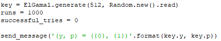
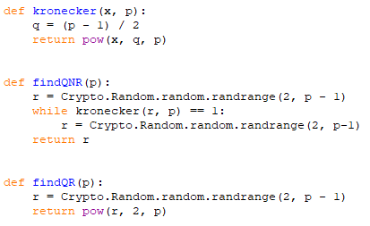

# VolgaCTF 2020 Qualifier
Giải này mình không tham gia nhiều, giải 1 bài Guess. Sau đây là writeup của mình

Guess

**Description**

Try to guess all encrypted bits and get your reward!

nc guess.q.2020.volgactf.ru 7777

[server.py](server.py)

**Soltion**

Khi netcat lên thì đề trả về 1 cặp số (y, p), sau đó là phần câu hỏi. Xem source thì đây là 2 số trong hệ mật mã ElGamal. 

Hệ ElGamal là hệ mã hóa khóa công khai. Các bạn có thể xem ở [đây](https://en.wikipedia.org/wiki/ElGamal_encryption)

Trong thư viện python, hệ Elgamal sẽ gồm: base là g, module là p, private key là x và public key là y. Với g^x = y (mod p). Ở đây đề cho ta y và p.

Tới phần challenge, challenge gồm 1000 vòng, mỗi vòng sẽ có 1 cặp **plaintext[0]** và **plaintext[1]** được sinh ra bởi 2 hàm **findQNR** và **findQR**. Chương trình chọn 1 bit ngẫu nhiên **challenge_bit** và 1 số ngẫu nhiên r để mã hóa **plaintext[challenge_bit]**. Nhắc lại cách mã hóa của Elgamal, với g, p, x, y ở trên thì việc mã hóa 1 bản tin m sẽ được tiến hành theo cách:

- Tính c1 = g^r mod p
- Tính c2 = m * y^r mod p, mà y = g^x mod p nên c2 = m * g^(x\*r) mod p

Server sẽ gửi về cho mình 2 giá trị này, công việc cần làm là xác định challenge_bit.

Okay. Xem thử 2 hàm **findQNR** và **findQR** nào.

Hmm, hàm **findQNR** sẽ sinh số r random khiến hàm **kronecker** khác 1. Hàm **kronecker** chính là tiêu chuẩn Euler để xác định 1 số có phải số chính phương modulo p hay không. Các bạn có thể tham khảo tại [đây](https://en.wikipedia.org/wiki/Euler%27s_criterion)

Dựa vào tiêu chuẩn Euler, hàm **kronecker** trả về 1 nếu x là số chính phương modulo p và trả về p-1 nếu không phải. Do đó hàm **findQNR** trả về 1 số KHÔNG là số chính phương modulo p. Hàm **findQR** thì ngược lại, trả về 1 số chính phương (có mũ 2 kìa) :))) Vậy **plaintext[0]** là 1 KHÔNG là số chính phương modulo p, còn **plaintext[1]** thì ngược lại.

*Note*: QR là viết tắt của quadratic resuide.

Ở mỗi challenge mình nhận 2 giá trị c1 và c2. Như đã nói ở trên, c1 = g^r và c2 = (plaintext[challenge_bit] * y^r) mod p. 

Vậy nếu giả sử mình có c1 = g^r là số chính phương, thì r = 2l, hoặc y = g^x là số chính phương, thì x = 2l. Nghĩa là y^r = g^(x\*r) sẽ là 1 số chính phương, vì x\*r chẵn khi x chẵn hoặc r chẵn. Từ đây mình suy ra nếu c2 là số chính phương thì **plaintext[challenge_bit]** bắt buộc cũng là số chính phương, tức **challenge_bit** là *1*. Ngược lại, c2 không là số chính phương thì **challenge_bit** là *0*.

Trong trường hợp ngược lại, c1 = g^r và y = g^x đều không là số chính phương thì y^r cũng không là số chính phương. Vậy nếu c2 là số chính phương thì ngược lại bên trên, **plaintext[challenge_bit]** không là số chính phương, **challenge_bit** là *0*. Ngược lại, c2 không là số chính phương thì **challenge_bit** là *1*.

Việc xác định 1 số a có là số chính phương modulo p hay không thì các bạn có thể dùng lại hàm **kronecker** bên trên. Mình viết hàm **legendre** tương tự thôi.

Xong, gom tất cả lại và mình có flag. Code của mình ở [đây](solution.py)

**Flag:** VolgaCTF{B3_c4r3ful_with_4lg0rithm5_impl3m3nt4ti0n5}

Cám ơn các bạn đã đọc.
