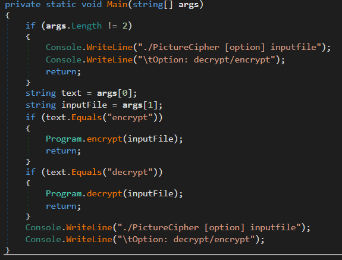
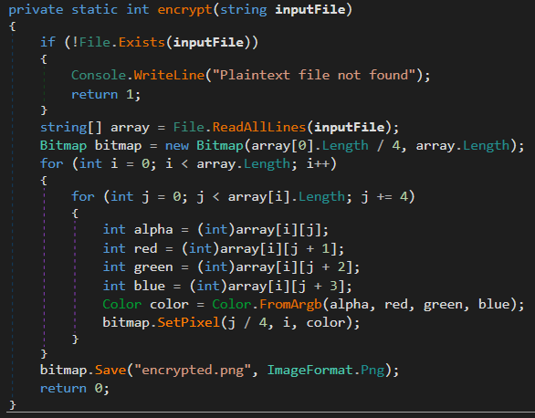
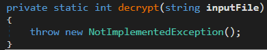

# EFIENS CTF 2019 Round 2

## 1. Picture Cipher

Bài này đề cho 1 file **PictureCipher.exe** là file mã hóa và file **encrypted.png** là file đã bị mã hóa. File mã hóa được viết bằng C# nên mình decompiler quen thuộc của C# là dnSpy để decompile. Cũng khá đơn giản, 3 hàm: Main, encrypt và decrypt =))))







Bây giờ mình cần xem thử file này đã encrypt như thế nào! 

Đầu tiên hàm này đọc tất cả các dòng (các dòng được hiểu là kết thúc bằng ký tự \n - endline) và lưu vào mảng các chuỗi **array**. Từ đó, biến **bitmap** - các bạn có thể tham khảo ở [đây](https://docs.microsoft.com/en-us/dotnet/api/system.drawing.bitmap?view=netframework-4.8) - được khởi tạo, có chiều rộng bằng độ dài dòng 1 chia 4 (array[0] / 4), và chiều cao là số dòng (array.Length). Tiếp theo, chương trình duyệt qua từng dòng, trên mỗi dòng mỗi lần lấy 4 ký tự (j, j + 1, j + 2 và j + 3) và đưa vào biến color ARGB để cài đặt màu tại vị trí (j / 4, i) cho ảnh **bitmap**. 

Bây giờ mình cần làm ngược lại quy trình trên, mình cần dựng lại mảng **array** như sau:

### 1. Số hàng = chiều cao (heigth) của ảnh

### 2. Số cột = chiều rộng (width) của ảnh x 4

Tiếp theo, mình cần lấy màu tại từng vị trí của file **encrypted.png**, duyệt giống lúc encrypt là duyệt từng hàng, trên từng hàng xét từng cột. Với mỗi vị trí (j, i) mình đưa màu về dạng ARGB (số integer 4 bytes) bằng hàm **ToArgb()** và đưa vào 1 chuỗi bytes, đảo ngược chuỗi bytes này và ghép vào dòng **array[i]**. Đây là code của mình:

```C#
private static int decrypt(string inputFile, string outputFile)
		{
            if (!File.Exists(inputFile))
            {
                Console.WriteLine("Ciphertext file not found");
                return 1;
            }
            Bitmap cipher = new Bitmap(inputFile);
            string[] array = new string[cipher.Height];
            for (int i = 0; i < cipher.Height; i++)
            {
                for(int j = 0; j < cipher.Width; j++)
                {
                    Color color = cipher.GetPixel(j, i);
                    int new_color = color.ToArgb();
                    byte[] bytes = BitConverter.GetBytes(new_color);
                    Array.Reverse(bytes);
                    Console.WriteLine(Encoding.UTF8.GetString(bytes));
                    array[i] += Encoding.UTF8.GetString(bytes);
                }
            }
            File.WriteAllLines(outputFile, array);
            return 0;
            // throw new NotImplementedException();
		}
```

Mình decrypt ra file **result**, bật lên xem thì các bạn có thể thấy flag chính là ký tự đầu tiên của mỗi dòng.

Code python: 
```python
flag = ''
with open('result', 'r') as f:
	line = f.readline()
	while line:
		print(line)
		flag += line[0]
		line = f.readline()
print(flag)
```
**Flag**: EFIENSCTF{If_you_spy_this_you_are_good_in_reversing_C#}

## 2. TapTap

Bài này nhìn có vẻ rất chua. Chạy thử file apk này (mình dùng Nox player) thì thấy rằng nếu click đủ số lần đề yêu cầu thì flag sẽ hiện ra =))))) đâu đó khoảng 1600 tỷ thôi......

Sau khi decompile file apk thì mình tìm tới *sources/com/efiensctf/luibo/taptapflag* và kiểm tra các file. Mình thấy được các hàm sau *liên quan* tới "những cú click" =)))) 

```java
private final Pair<String, Long> getTableAndOffset(char it) {
        if (Character.isLowerCase(it)) {
            return new Pair<>("abcdefghijklmnopqrstuvwxyz", Long.valueOf((long) (it - 'a')));
        } else if (Character.isUpperCase(it)) {
            return new Pair<>("ABCDEFGHIJKLMNOPQRSTUVWXYZ", Long.valueOf((long) (it - 'A')));
        } else if (Character.isDigit(it)) {
            return new Pair<>("0123456789", Long.valueOf((long) (it - '0')));
        } else {
            String t = "!\"#$%&'()*+,-./:;<=>?@[\\]^_`{|}~";
            return new Pair<>(t, Long.valueOf((long) StringsKt.indexOf$default((CharSequence) t, it, 0, false, 6, (Object) null)));
        }
    }

    private final char decodeChar(char it) {
        Pair tableAndOffset = getTableAndOffset(it);
        String table = (String) tableAndOffset.component1();
        return table.charAt((int) ((this.tapsLeft + ((Number) tableAndOffset.component2()).longValue()) % ((long) table.length())));
    }

    /* access modifiers changed from: private */
    public final void calculateFlag() {
        String str = BuildConfig.FLAVOR;
        CharSequence $this$forEach$iv = this.flagText;
        String str2 = str;
        for (int i = 0; i < $this$forEach$iv.length(); i++) {
            char it = $this$forEach$iv.charAt(i);
            StringBuilder sb = new StringBuilder();
            sb.append(str2);
            sb.append(decodeChar(it));
            str2 = sb.toString();
        }
        this.flagText = str2;
        this.tapsLeft--;
        TextView textView = (TextView) _$_findCachedViewById(C0373R.C0375id.flag);
        Intrinsics.checkExpressionValueIsNotNull(textView, "flag");
        textView.setText(getResources().getString(R.string.flag, new Object[]{this.flagText}));
        TextView textView2 = (TextView) _$_findCachedViewById(C0373R.C0375id.hint);
        Intrinsics.checkExpressionValueIsNotNull(textView2, "hint");
        textView2.setText(getResources().getString(R.string.hint, new Object[]{Long.valueOf(this.tapsLeft)}));
    }
```

Hàm **calculateFlag** chịu trách nhiệm ghi nhận "các cú click": xử lý flag sau mỗi lần click và trừ số lần click (tapsLeft). Vòng lặp hơi loằng ngoằng chút, nhưng thực chất vẫn là duyệt qua chuỗi hiện tại, decode mỗi ký tự (bằng hàm **decodeChar**) và đưa vào chuỗi mới.

Hàm **getTableAndOffset** kiểm tra xem ký tự đầu vào là chữ thường, chữ hoa, số hay ký tự khác và trả về 1 cặp table - offset của ký tự trong table.

Hàm **decodeChar** nhận vào 1 ký tự, tìm table và offset của nó bằng hàm **getTableAndOffset**. Từ đó, ký tự nhận vào sẽ được decoder bằng cách: ký tự (mới) = (tapsLeft + offset của ký tự cũ trong table) % độ dài table.

Nhìn vào flag mình thấy chỉ có chữ hoa và số! Đỡ rồi =)))) Sau đây là flagText cần decode và tapsLeft.

```java
private String flagText = "Q806R554767513UR32QS4Q4120T00V91";
    private long tapsLeft = 1628775989156L;
```

Liệu có cách nào giúp mình tính từ lần 1628775989156 về lần 1 trong 1 vài phép tính không nhỉ? :D

Quay lại công thức decode trên: offset của ký tự (mới) = (tapsLeft + offset của ký tự cũ trong table) % độ dài table
                                            = (tapsLeft + (tapsLeft - 1 + offset của ký tự cũ **hơn** trong table)) % độ dài table
                                            = (tapsLeft + tapsLeft - 1 + (tapsLeft - 2 + offset của ký tự cũ hơn **nữa nữa** trong table)) % độ dài table
                                            = .........
                                            = ((tổng từ tapsLeft tới 1) + ký tự cần tính) % độ dài table

Việc tính tổng từ tapsLeft tới 1 có thể dùng công thức toán là (tapsLeft * (tapsLeft + 1)) / 2 và mình đặt là **n** =))))) Do flag chỉ có chữ hoa và số nên độ dài table lần lượt là 26 và 10 nên mình sẽ modulo **n** cho đỡ phức tạp.

```python
flagText = "Q806R554767513UR32QS4Q4120T00V91"
tapsLeft = 1628775989156
n = (tapsLeft) * (tapsLeft + 1) // 2
upper = n % 26
digit = n % 10
flag = ""
for i in flagText:
	if i.isupper():
		flag += chr((ord(i) - 65 + upper) % 26 + ord("A")) // offset nên các bạn nhớ cộng cho "A" để nó thành chữ hoa nhé
	elif i.isdigit():
		flag += chr((ord(i) - 48 + digit) % 10 + ord("0")) // tương tự, để offset thành số
print("EFIENSCTF{" + flag + "}")
```
**Flag**: EFIENSCTF{A462B110323179EB98AC0A0786D66F57}

Cám ơn các bạn đã đọc :D